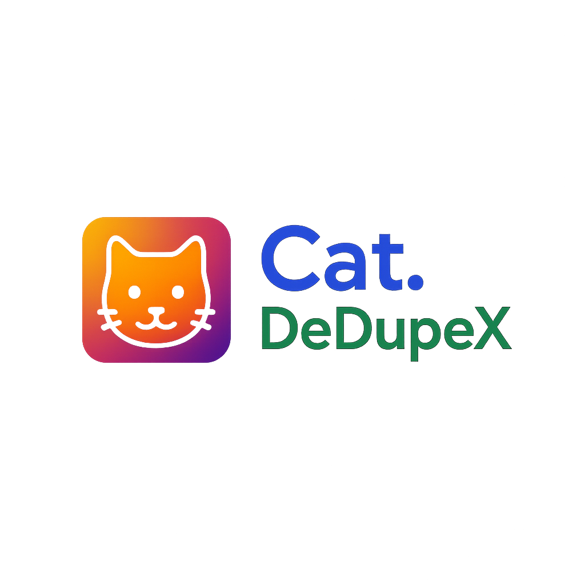

<!-- Header avec logo à gauche et titre centré -->
<table>
  <tr>
    <td align="left" width="20%">
      
    </td>
    <td align="center" width="80%">
      <h1>Cat.DeDupeX</h1>
      <p><em>Outil de déduplication des jeux de données pour un catalogue de métadonnées</em></p>
    </td>
  </tr>
</table>

---

## 📌 Description

Brève description du projet.

Ce projet permet de :

- ✔ Fonctionnalité 1
- ✔ Fonctionnalité 2
- ✔ Fonctionnalité 3

---

## 🚀 Installation

```bash
git clone https://github.com/votre-utilisateur/votre-repo.git
cd votre-repo
pip install -r requirements.txt


