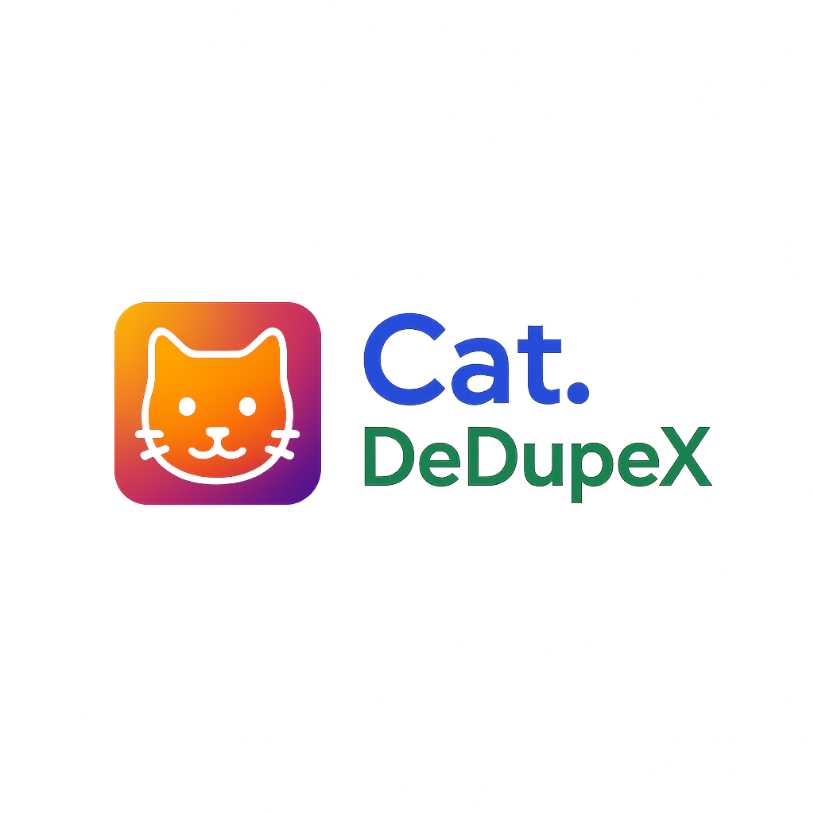

<!-- Header avec logo à gauche et titre centré -->
<table>
  <tr>
    <td align="left" width="20%">
      
    </td>
    <td align="center" width="80%">
      <h1>Cat.DeDupeX</h1>
      <p><em>Outil de déduplication des jeux de données pour un catalogue de métadonnées</em></p>
    </td>
  </tr>
</table>

---

# 🔍 Data Quality — Détection de Doublons (TF-IDF + FuzzyWuzzy)

Outil de qualité de données avec interface graphique (PySide6) conçu pour détecter les jeux de données en doublon dans un catalogue open data. Il combine plusieurs algorithmes de similarité textuelle (FuzzyWuzzy, TF-IDF cosinus) et permet de dépublier des entrées directement via l'API du catalogue.

> Initialement développé pour le portail [PNDB](https://www.pndb.fr), mais adaptable à tout catalogue open data exposant une API compatible.

---

## ✨ Fonctionnalités

- **Téléchargement du catalogue** depuis une URL configurable (avec mise en cache compressée `.csv.gz`)
- **Gestion multi-versions** du catalogue : sélection et comparaison de versions historiques
- **Détection de doublons multi-règles** :
  - `TOTAL` — Identité exacte titre + description (score 100 %)
  - `FORTE` — Similarité FuzzyWuzzy (Ratio titre + Token Set description, pondéré 2:1)
  - `TFIDF` — Similarité cosinus TF-IDF (titre + description, pondéré 2:1, avec gestion de l'asymétrie)
  - `PROBABLE` — Similarité sur les mots-clés (Token Set Ratio)
- **Analyse parallèle** via `ProcessPoolExecutor` avec technique de blocage (*blocking*) sur les 5 premiers caractères du titre
- **Rapport CSV** exportable (`rapport_doublons_final.csv`) avec niveau de doublon, score, critère et numéros de lignes
- **Vue de comparaison côte-à-côte** avec mise en évidence (highlight) des différences entre les deux entrées
- **Dépublication via API** directement depuis l'interface (avec confirmation et gestion des erreurs)
- **Export "ground truth"** pour évaluation des modèles
- **Paramètres ajustables** : activation/désactivation des règles, seuils de similarité configurables

---

## 📋 Prérequis

- Python 3.9+
- Les dépendances listées ci-dessous

---

## 🚀 Installation

```bash
# Cloner le dépôt
git clone https://github.com/<votre-organisation>/<votre-repo>.git
cd <votre-repo>

# Installer les dépendances
pip install pandas pyside6 fuzzywuzzy python-Levenshtein requests scikit-learn python-dotenv
```

> `python-Levenshtein` est optionnel mais fortement recommandé : il accélère significativement les calculs FuzzyWuzzy.

---

## ⚙️ Configuration

Créez un fichier `.env` à la racine du projet pour y stocker votre clé API :

```env
API_KEY=votre_cle_api_ici
```

Les paramètres globaux sont également ajustables directement en tête du script :

| Paramètre | Valeur par défaut | Description |
|---|---|---|
| `SOURCE_URL` | URL PNDB | URL d'export CSV du catalogue |
| `INPUT_DELIMITER` | `;` | Délimiteur du CSV source |
| `OUTPUT_DELIMITER` | `ǂ` | Délimiteur du CSV rapport |
| `OUTPUT_FILENAME` | `rapport_doublons_final.csv` | Nom du fichier rapport |
| `CATALOG_CACHE_DIR` | `catalogs_cache/` | Dossier de cache des catalogues |
| `UID_COLUMN_NAME` | `datasetid` | Colonne identifiant unique pour l'API |
| `BLOCK_KEY_LENGTH` | `5` | Longueur du préfixe de blocage |
| `NUM_PROCESSES` | `os.cpu_count()` | Nombre de processus parallèles |

---

## ▶️ Lancement

```bash
python Soft_DataQuality_CheckDuplicate_TFIDF_Report.py
```

---

## 🖥️ Interface

L'interface se compose de deux zones principales :

**Barre de contrôle (haut)**
- `⬇️ Télécharger le Catalogue` — Télécharge et met en cache le catalogue depuis l'URL source
- Sélecteur de version du catalogue
- `🚀 Lancer l'analyse` — Démarre la détection de doublons (multiprocessing)
- `⚙️ Paramètres` — Configure les règles et les seuils de similarité
- `📊 Générer le ground truth` — Exporte les lignes cochées pour évaluation

**Zone principale (divisée verticalement)**
- **Tableau de rapport** — Liste toutes les paires de doublons détectées avec leur niveau, score et critère
- **Vue de comparaison** — Affiche côte-à-côte les champs des deux entrées sélectionnées, avec les mots différents surlignés en jaune ; boutons de dépublication API disponibles pour chaque entrée

---

## 📊 Règles de détection

### Règle `TOTAL` — Identité exacte
Détecte les paires dont le titre **et** la description (après nettoyage) sont strictement identiques. La description doit dépasser 20 caractères pour éviter les faux positifs sur des champs vides.

### Règle `FORTE` — FuzzyWuzzy
Calcule un score combiné :
- **Titre** : `fuzz.ratio` (comparaison caractère par caractère)
- **Description** : `fuzz.token_set_ratio` (tolérant à l'ordre des mots)
- Pondération **2:1** (titre:description) si la description est significative, sinon titre seul

### Règle `TFIDF` — Similarité cosinus TF-IDF
Même pondération 2:1 que la règle FORTE, mais via la similarité cosinus sur des vecteurs TF-IDF. Gère les cas d'asymétrie : si une entrée a une description longue et l'autre non, le score de description est forcé à 0 (pénalisation).

### Règle `PROBABLE` — Mots-clés
Compare les mots-clés (`default.keyword`) via `fuzz.token_set_ratio`. Utile pour détecter des doublons avec des titres différents mais un sujet identique.

---

## 📁 Structure du projet

```
.
├── Soft_DataQuality_CheckDuplicate_TFIDF_Report.py   # Script principal
├── .env                                               # Clé API (non versionné)
├── catalogs_cache/                                    # Catalogues mis en cache (.csv.gz)
│   └── catalogue_YYYY-MM-DD_HH-MM-SS.csv.gz
└── rapport_doublons_final.csv                         # Dernier rapport généré
```

---

## 📦 Dépendances

| Bibliothèque | Usage |
|---|---|
| `pandas` | Manipulation des données tabulaires |
| `PySide6` | Interface graphique (Qt6) |
| `fuzzywuzzy` | Similarité floue (Levenshtein) |
| `python-Levenshtein` | Accélération de FuzzyWuzzy |
| `scikit-learn` | Vectorisation TF-IDF et similarité cosinus |
| `requests` | Téléchargement du catalogue et appels API |
| `python-dotenv` | Chargement de la clé API depuis `.env` |

---

## 🔒 Sécurité

- La clé API n'est **jamais** codée en dur dans le script ; elle est chargée depuis une variable d'environnement via `.env`.
- Ajoutez `.env` à votre `.gitignore` pour ne pas la versionner.

```gitignore
.env
catalogs_cache/
rapport_doublons_final.csv
```

---

## 📄 Licence

À définir selon les politiques de votre organisation.
